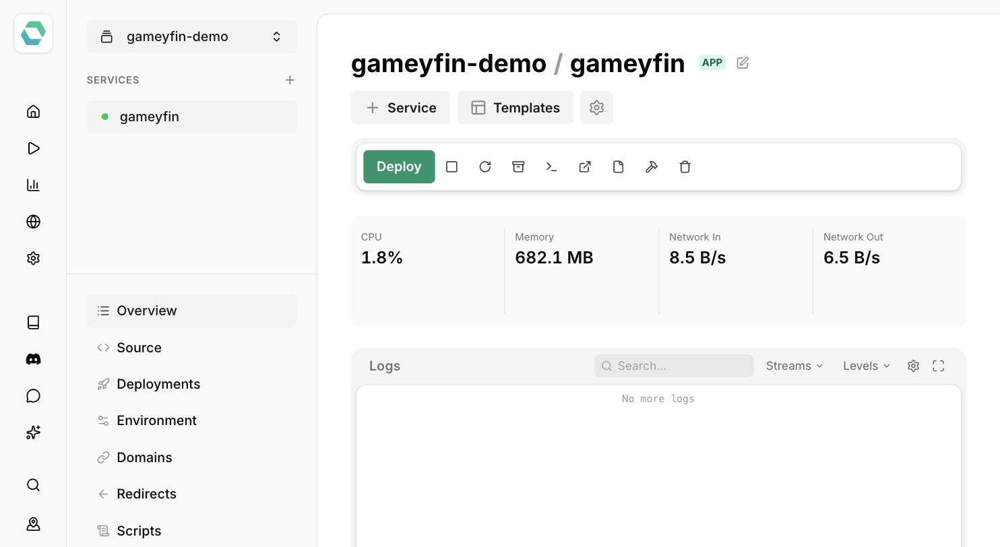

# Easypanel Installation

[Easypanel](https://easypanel.io) is a self-hosted Docker deployment platform, and Gameyfin has a one-click deployment template there.

## Installation Steps

1. Open your Easypanel panel and create a new project.
2. Deploy the [Gameyfin template](https://easypanel.io/templates/gameyfin) - Easypanel will generate the `APP_KEY` and set up the required volumes (`db`, `data`, `plugindata`, `logs`, `library`) automatically.
3. Once deployed, access Gameyfin at the domain Easypanel assigns to the service.

## First steps

Proceed to the [Getting Started](getting-started.md) guide to learn how to configure Gameyfin and add your media library.
